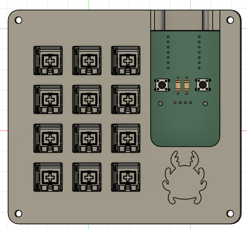
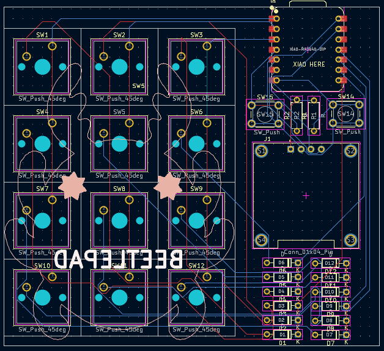

## Beetlepad
Beetepad is a macropad I created to help me with art. It has 12 keys and an OLED display that displays a idling beetle. It also has a beetle on the case cause I like them

In the future (once I get better at coding) I want to make the keys swappable so there's two buttons above the screen that can be used to switch the key layout
## CAD
 
 

Made in Fusion 360. The top and bottom of the case are screwed together. This is also my first time importing DXF files for the holes and beetle on the top and I feel like I'll use it in the future to add things on my team's FTC robot :>

## PCB

Made in Kicad! I had some experience from solder so making the PCB wasn't too bad. 

## BOM

- 1x XIAO RP2040
- 14x Diodes
- 12x Cherry MX Switches
- 1x OLED display
- 12x DSA keycaps
- 4x M3x16mm screws
- 4x M3x5mx4mm heatset inserts
- 1x case
